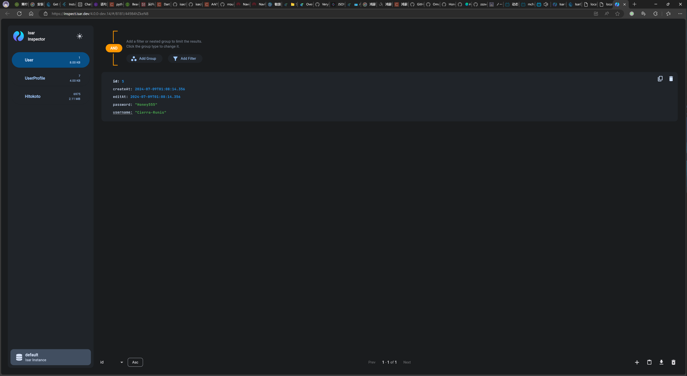

1. 安装 [Dart](https://dart.dev/get-dart) 或 [Flutter](https://docs.flutter.dev/get-started/install)（推荐）
2. 在 `server` 根目录下的终端内使用命令 `dart pub get` 获取依赖
3. 使用 `dart pub global activate dart_frog_cli` 命令安装 [Dart Frog](https://dartfrog.vgv.dev/docs/overview)
4. 使用 `dart_frog dev` 启动服务器

   ```bash
   PS D:\Desktop\NEW\Huawei\Honey\server> dart_frog dev
   ✓ Running on http://localhost:8080 (0.2s)
   The Dart VM service is listening on http://127.0.0.1:8181/44984hZkeN8=/
   The Dart DevTools debugger and profiler is available at: http://127.0.0.1:8181/44984hZkeN8=/devtools?uri=ws://127.0.0.1:8181/44984hZkeN8=/ws
   [hotreload] Hot reload is enabled.
   Press either R or r to reload
   ```

   显示如上即成功启动服务器

5. 访问 `http://localhost:8080/api/hitokoto` 获取随机句子后终端显示

   ```bash
   2024-07-09T02:47:02.040271  0:00:00.086031 GET     [200] /api/hitokoto
   ╔══════════════════════════════════════════════════════════╗
   ║                   ISAR CONNECT STARTED                   ║
   ╟──────────────────────────────────────────────────────────╢
   ║           Open the link to connect to the Isar           ║
   ║          Inspector while this build is running.          ║
   ╟──────────────────────────────────────────────────────────╢
   ║ https://inspect.isar.dev/4.0.0-dev.14/#/8181/44984hZkeN8 ║
   ╚══════════════════════════════════════════════════════════╝
   ```

   打开链接即可查看数据库

   
